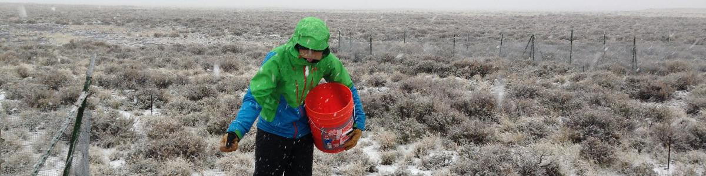

I am a National Science Foundation Postdoctoral Fellow in Biology and Mathematics working with [Peter Adler](https://qcnr.usu.edu/labs/adler_lab/) at Utah State University and [Fred Adler](http://www.math.utah.edu/~adler/) at the University of Utah. My research seeks to understand the **causes and consequences of biodiversity** and to predict the impacts of climate change on plant populations.

Contact me at atredenn@gmail.com

Follow me on [twitter](https://twitter.com/atredennick?lang=en) and fork me on [GitHub](https://github.com/atredennick).

<!--
<iframe src="https://publons.com/author/1003663/widget/embed/?width=640&height=460" width="540" height="360" style="border: solid 1px #ddd;"></iframe>
-->

