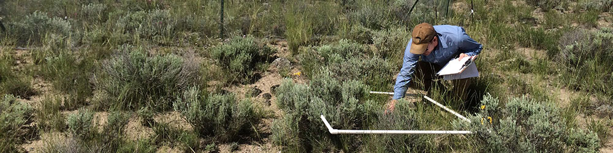

I am a National Science Foundation Postdoctoral Fellow in Biology and Mathematics working with [Peter Adler](https://qcnr.usu.edu/labs/adler_lab/) at Utah State University and [Fred Adler](http://www.math.utah.edu/~adler/) at the University of Utah. My research seeks to understand the **causes and consequences of biodiversity** and to predict the impacts of climate change on plant populations.

Contact me at atredenn@gmail.com

Follow me on [twitter](https://twitter.com/atredennick?lang=en) and fork me on [GitHub](https://github.com/atredennick).

 
 
----------------------------------------
 
 

## News

* Our NEON and Powell Center workshop report, led by Mike Dietze, on the necessity of near-term, iterative forecasts in ecology now [online](http://figshare.com/articles/Iterative_ecological_forecasting_Needs_opportunities_and_challenges/4715317).

* New paper on synchrony of dominant species in five grasslands to be published in *Ecology* ([online early](http://onlinelibrary.wiley.com/doi/10.1002/ecy.1757/full)).

* New (preprint)[http://biorxiv.org/content/early/2017/01/04/098384] posted on bioRxiv on species coexistence, environmental variability, and ecosystem stability.

